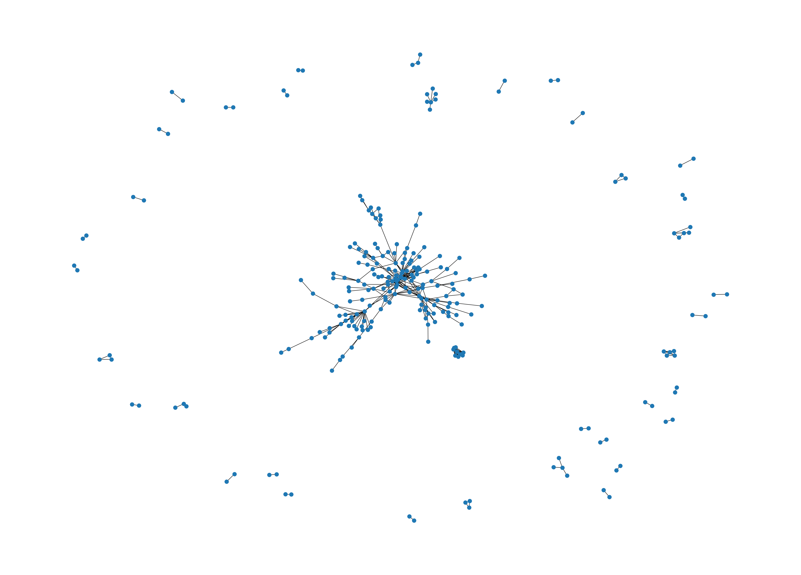
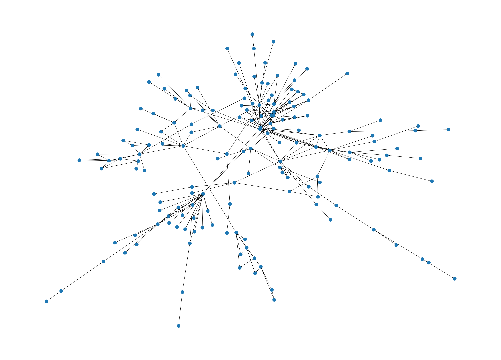

# OpenAlex LUISS Co-authorship Network
Developers: 
* Marco Malliani 324971
* Ryder Mills Wood 321481

### Project pipeline

This project constructs an institution-scoped co-authorship network from OpenAlex data. The final artifact is a weighted, undirected graph where each node is an OpenAlex author ID and each edge weight equals the number of works co-authored by that author pair, restricted to works that include at least two institution authors.

Repository structure
- `Data/`
  - `Raw/`
    - `raw_authors.jsonl`
    - `raw_works.jsonl`
  - `Derived/`
    - `derived_works.jsonl`
    - `hyperedges.jsonl`
    - `edges.csv`
- `Scripts/`
  - `fetch_raw_data.py`
  - `derive_data.py`
  - `build_network.py`
- `utils/`
  - `project_paths.py`
  - `interactive_graph_converter.py`

Requirements:
- Python 3.10+
- Dependencies:
  - `pyalex`
  - `networkx`
  - `matplotlib`
  - `pyvis`

Minimal installation:
```bash
pip install -r requirements.txt
```

---

### Script: `fetch_raw_data.py`

Purpose:
Fetches the raw OpenAlex data needed for downstream network construction:
1) The set of authors whose `last_known_institutions.id` matches the target institution.
2) The set of works associated with those authors (via `authorships.author.id`), storing each work’s `id`, `publication_year`, and full `authorships` list of objects.

**Outputs:**

`raw_authors.jsonl` — stores all author IDs related to the target institution.

Example: 
```jsonl
{"id": "https://openalex.org/A5080418179"}
{"id": "https://openalex.org/A5008833108"}
{"id": "https://openalex.org/A5110725650"}
```

---

`raw_works.jsonl` — works containing `id`, `publication_year`, `authorships`.

Example:
> ℹ️ **NOTE**:
> </br> **In the actual file this appears as one JSON object per line, we have formatted it here for readability.**
``` 
{
  "id": "https://openalex.org/W2108863621",
  "publication_year": 2011,
  "authorships": [
    {
      "author_position": "first",
      "author": {
        "id": "https://openalex.org/A5037980725",
        "display_name": "Elena Golovko",
        "orcid": "https://orcid.org/0000-0002-9564-0849"
      },
      "institutions": [
        {
          "id": "https://openalex.org/I193700539",
          "display_name": "Tilburg University",
          "country_code": "NL",
          "type": "education"
        }
      ],
      "is_corresponding": true
    },
    {
      "author_position": "last",
      "author": {
        "id": "https://openalex.org/A5004648400",
        "display_name": "Giovanni Valentini",
        "orcid": "https://orcid.org/0000-0002-6252-5262"
      },
      "institutions": [
        {
          "id": "https://openalex.org/I71209653",
          "display_name": "Bocconi University",
          "country_code": "IT",
          "type": "education"
        }
      ],
      "is_corresponding": false
    }
  ]
}
``` 

---

### Script: `derive_data.py`

Purpose:
Transforms the raw OpenAlex JSONL into progressively more analysis-ready artifacts used for co-authorship network construction.

This script runs three derivation steps (in order):
1) `derived_works.jsonl`: reduce each raw work to a compact record containing only `work_id`, `publication_year`, and the list of all author IDs on the work.
2) `hyperedges.jsonl`: for each derived work, keep only the subset of authors who are in the institution author set. Only works with at least 2 institution authors are written (these are the “edge-producing” works).
3) `edges.csv`: convert each hyperedge (a set of ≥2 institution authors on one work) into all pairwise author combinations and aggregate counts across works as edge weights.

Here is the visual representation of how the data changes step by step:
1) **Raw Input** (from raw_works.jsonl):

  ``` 
  # simplified, look for full above
  
  {
    "id": "https://openalex.org/W3045741511",
    "publication_year": 2020,
    "authorships": [
      {
        "author": {
          "id": "https://openalex.org/A5008236776",
          "display_name": "Francesco Cappa"
        },
        "institutions": []
      },
      [...]
        "institutions": []
      }
    ]
  }
  ```

2) **Derived work record** (derived_works.jsonl):

> ℹ️ **NOTE**:
> </br> **Here as you can see we got rid of most of the `authorship` objects features and only kept authors `id`**

  ``` 
  {
    "work_id": "https://openalex.org/W3045741511",
    "authors": [
      "https://openalex.org/A5008236776",
      "https://openalex.org/A5051841971",
      "https://openalex.org/A5003571840",
      "https://openalex.org/A5055453377"
    ],
    "publication_year": 2020
  }
  ```

3) **Hyperedge** (hyperedges.jsonl)

> ℹ️ **NOTE**:
> </br> **In the hyperedges we are only considering authors from the target institution!**

``` 
{
  "work_id": "https://openalex.org/W3045741511",
  "institution_author_ids": [
    "https://openalex.org/A5003571840",
    "https://openalex.org/A5008236776",
    "https://openalex.org/A5051841971"
  ],
  "institution_author_count": 3,
  "publication_year": 2020
}
```

4) Finally, **Pairwise edges** (edges.csv)

| author_id_1                          | author_id_2                          | weight |
|--------------------------------------|--------------------------------------|--------|
| https://openalex.org/A5000069300     | https://openalex.org/A5104728998     | 4      |
| https://openalex.org/A5000252858     | https://openalex.org/A5001719110     | 4      |
| https://openalex.org/A5000252858     | https://openalex.org/A5008236776     | 12     |

---

### Script: `build_networkx_graph.py`

**Purpose:**
Loads the weighted pairwise co-authorship edges (`edges.csv`) into a NetworkX undirected graph, then extracts and analyzes the largest connected component (LCC).

**Outputs:**
- Console summary (nodes/edges, component counts, top-10 degree, top-10 strength)
- A Matplotlib window showing the spring-layout visualization of the largest component

**The original graph:** (all authors/edges produced by the pipeline)


**The largest-component graph:** (the induced subgraph of the LCC)


> ℹ️ **Why we select the largest connected component:**
> </br> The full co-authorship graph is fragmented into many disconnected components. This occurs naturally because some author groups never co-author with others within the institution-scoped dataset, resulting any network measures and visualizations become less interpretable on highly disconnected graphs.
